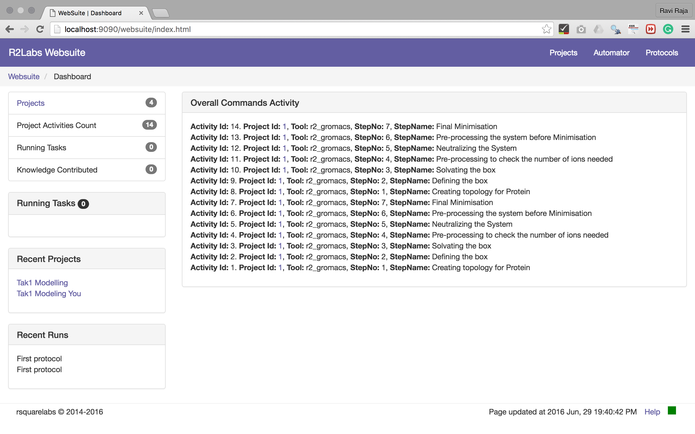
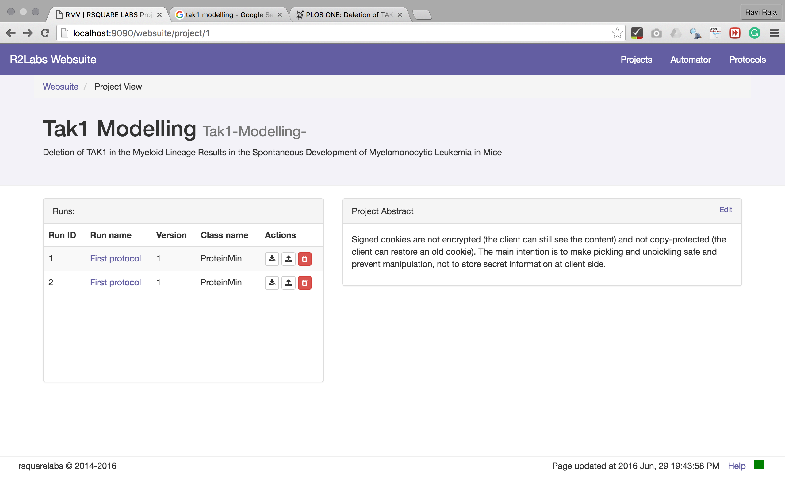
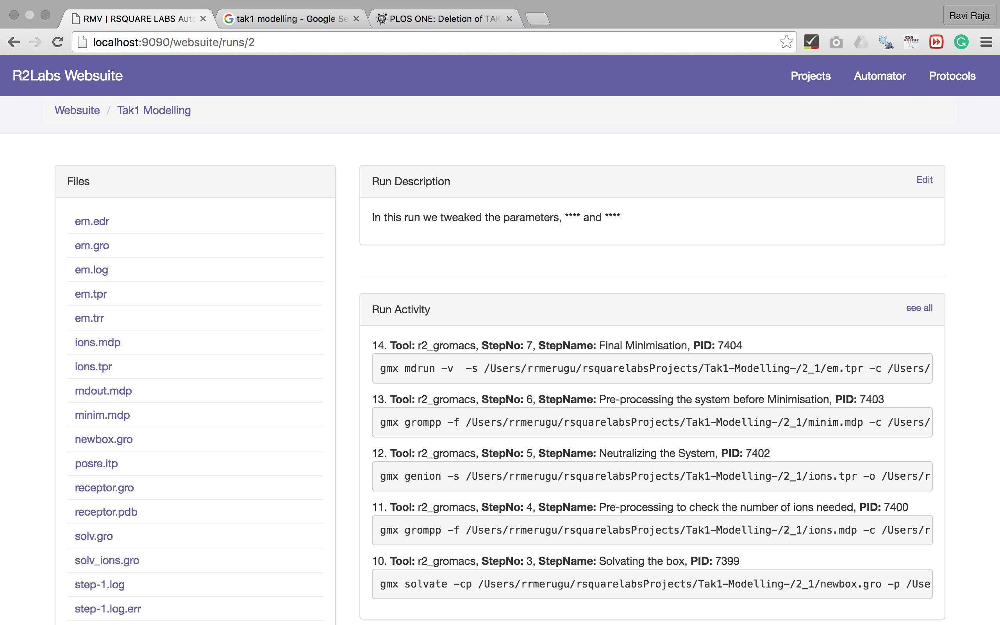

# framework

[](https://travis-ci.org/rsquarelabs/core-client)
[](https://requires.io/github/rsquarelabs/core-client/requirements/?branch=dev)
[](https://codecov.io/gh/rsquarelabs/core-client)
[](http://www.apache.org/licenses/LICENSE-2.0.html)


This is the core engine of automation pipeline and research tracking modules.









[Website](http://rsquarelabs.com) |
[Documentation](https://developers.rsquarelabs.com/core-client/) |
[Mailing List](https://groups.google.com/d/forum/rsquarelabs-core) |


## Summary
- [**Install**](#install)
- [**Features**](#features)
- [**Community**](#community)
- [**Roadmap**](#roadmap)
- [**Support**](#support)
- [**License**](#license)


## Install
```
pip install rsquarelabs-client
```
**we currently support python 2.7 only**

 
## Features
1. scaffolding the project
2. project management
3. Tracking the project


## Community
Want to join an open source project? Now it's your chance!

Don't know what you want to help out with? Well here are some areas that we could use help with:

- scientific thoughts,
- technical stack
- coding - see [milestones](https://github.com/rsquarelabs/core-client/milestones) and [issues](https://github.com/rsquarelabs/core-client/issues) for more
- [documentation](http://developers.rsquarelabs.com/core-client/), [tutorials](http://developers.rsquarelabs.com/core-client/user-guide/tutorial/)) and [Usecases](http://developers.rsquarelabs.com/core-client/user-guide/usercases/)
- [website](http://developers.rsquarelabs.com)
- If you want to join our community as a contributor, please leave a message as [@rrmerugu](https://twitter.com/rrmerugu)


 
## Support

We support universities and research labs in setting up this client for automating and tracking their research .

## License

Copyright 2016 Ravi Raja Tejasvi Merugu

Licensed under the Apache License, Version 2.0 (the "License"); you may 
not use this file except in compliance with the License. You may obtain 
a copy of the License at

    http://www.apache.org/licenses/LICENSE-2.0
    
Unless required by applicable law or agreed to in writing, software 
distributed under the License is distributed on an "AS IS" BASIS, WITHOUT 
WARRANTIES OR CONDITIONS OF ANY KIND, either express or implied. See the 
License for the specific language governing permissions and limitations 
under the License.